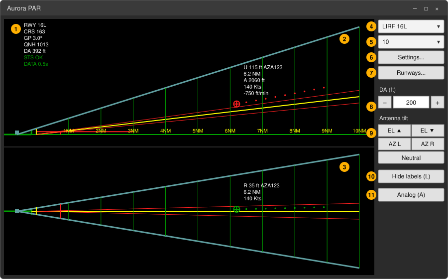
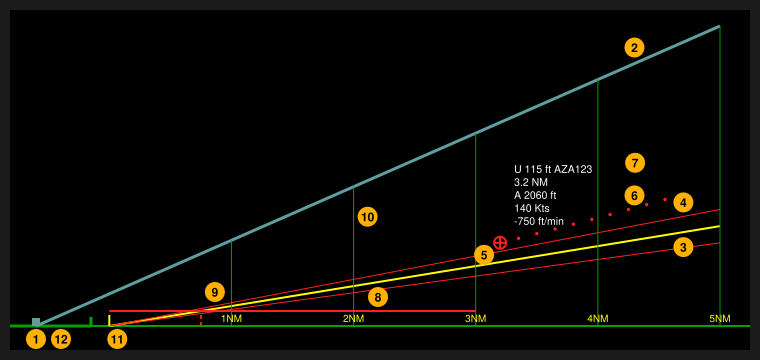
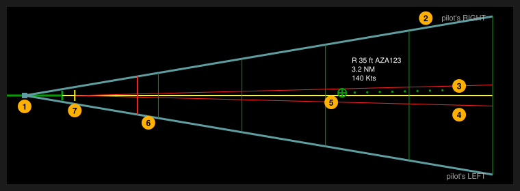
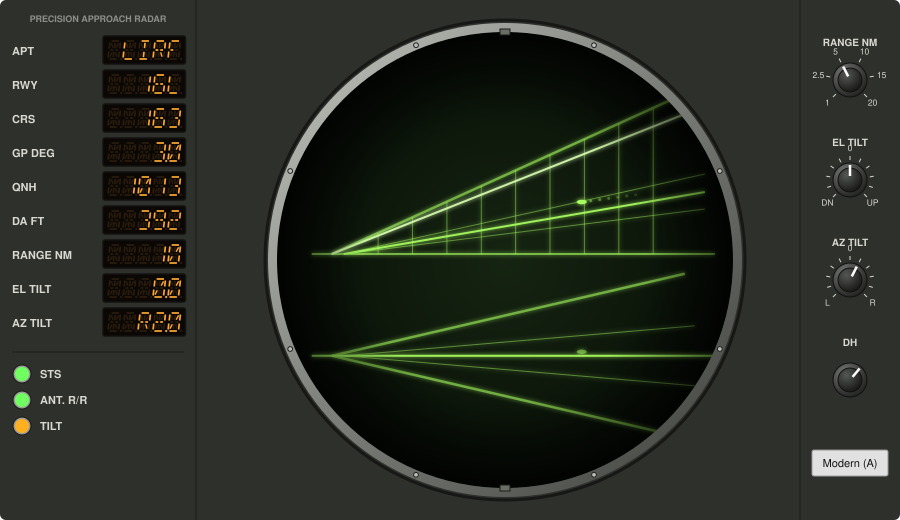
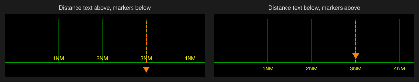

# AuroraPAR v2 — User Manual

AuroraPAR is a **Precision Approach Radar (PAR)** display for the IVAO **Aurora** ATC client. It reads the traffic from Aurora and shows, for the selected runway, the two classic PAR views: **elevation** (glide path) above and **azimuth** (centreline) below. It is meant for controllers giving PAR / talk-down approaches on IVAO.

*The pictures are illustrations of the program, not screenshots.*

This manual describes AuroraPAR v2, an unofficial evolution of [AuroraPAR](https://github.com/bornac1/AuroraPAR) by bornac1.

---

## Contents

1. [Installation and first start](#1-installation-and-first-start)
2. [Connecting to Aurora](#2-connecting-to-aurora)
3. [The main window](#3-the-main-window)
4. [Reading the display](#4-reading-the-display)
5. [Tracks, history and labels](#5-tracks-history-and-labels)
6. [Controls and keyboard](#6-controls-and-keyboard)
7. [Antenna tilt](#7-antenna-tilt)
8. [Decision height](#8-decision-height)
9. [Analog mode](#9-analog-mode)
   - [9b. Coordination panel](#9b-coordination-panel)
10. [Settings and profiles](#10-settings-and-profiles)
11. [Display style: range marks, colours, reminders](#11-display-style-range-marks-colours-reminders)
12. [Runways and the runway editor](#12-runways-and-the-runway-editor)
13. [Where the settings are stored](#13-where-the-settings-are-stored)
14. [Troubleshooting](#14-troubleshooting)
15. [Quick reference](#15-quick-reference)

---

## 1. Installation and first start

1. On the project's GitHub page open the **Actions** tab, open the latest successful **Build** run and download **AuroraPAR-win-x64** from the *Artifacts* section.
2. Unzip it into a folder of your choice. It contains:
   - `AuroraPAR.exe` — the program (Windows 64-bit, nothing else to install);
   - `runways.par` — the runway database (keep it **next to** `AuroraPAR.exe`);
   - this manual.
3. Run `AuroraPAR.exe`.

To update, download the new build and replace the files. Your settings are stored elsewhere (see [section 13](#13-where-the-settings-are-stored)) and are kept. If you edited `runways.par`, keep your copy.

---

## 2. Connecting to Aurora

AuroraPAR connects automatically to Aurora on the same PC (local port 1130). Start Aurora and AuroraPAR in any order: the connection is retried every few seconds and restored automatically if it drops.

**Important — Aurora traffic refresh rate.** By default Aurora updates the traffic every 3 seconds, which is too slow for a PAR (tracks move in jumps). In Aurora set the **traffic refresh rate to 0.5 s**. AuroraPAR checks it for you (see *DATA* in [section 4.4](#44-information-area)).

The QNH is taken from the METAR of the airport in Aurora and refreshed every minute.

---

## 3. The main window



| | |
|---|---|
| **1** | Information area ([4.4](#44-information-area)) |
| **2** | Elevation view ([4.2](#42-elevation-view-top)) |
| **3** | Azimuth view ([4.3](#43-azimuth-view-bottom)) |

**Right column, from the top (4–11):**

| | Control | Use |
|---|---|---|
| **4** | Runway list | Selects the runway (from `runways.par`). |
| **5** | Range list | Display range: 1, 2.5, 5, 10, 15 or 20 NM. The mouse wheel over the display does the same. |
| **6** | **Settings...** | Profiles and options ([section 10](#10-settings-and-profiles)). |
| **7** | **Runways...** | Runway editor ([section 12](#12-runways-and-the-runway-editor)). |
| **8** | **DH** box with **−** / **+** | Decision height for this session ([section 8](#8-decision-height)). |
| **9** | **Antenna tilt** | EL ▲ / EL ▼, AZ L / AZ R, Neutral ([section 7](#7-antenna-tilt)). |
| **10** | **Hide labels (L)** | Hides / shows all labels. |
| **11** | **Analog (A)** | Switches to the analog scope ([section 9](#9-analog-mode)). |

The window remembers its size and position, the runway and the range for the next start. If the column is too short for all the controls (small window), it shrinks to fit.

---

## 4. Reading the display

### 4.1 Common elements

Both views are drawn as seen from the side of the runway, with the **antenna** (small square) near the edge of the view and the approach extending away from it. The runway can be on the left or on the right of the screen ([section 10](#10-settings-and-profiles)).

- **Touchdown point** (small yellow mark on the runway): all distances are measured **from the touchdown point**, as controllers give them on final. It is where the glide path meets the runway (about 290 m from the threshold for 50 ft TCH and 3°), or a value set for the runway.
- **Range marks**: vertical lines at fixed distances from touchdown, with the distance written below them in the elevation view. Which marks are drawn at each range is configurable ([section 11.1](#111-range-marks)).
- **Scan limits** (blue lines from the antenna): the area the radar sees. A track is shown only inside them.
- **Approach limits** (red lines from the touchdown point): the tolerance around the glide path / centreline. Inside them a track is **green**, outside **red**.
- Between touchdown and threshold the glide path, centreline and approach limits are **dashed**; beyond the threshold they are solid.

The antenna always stays at the same place: zooming in enlarges the approach, it does not move the picture. The part of the runway behind the antenna is outside the scan and is not drawn.

### 4.2 Elevation view (top)



| | | | |
|---|---|---|---|
| **1** Antenna | **4** Approach limits | **7** Label | **10** Range marks |
| **2** Upper scan limit | **5** Track (red: outside the limits) | **8** Decision height | **11** Touchdown point |
| **3** Glide path | **6** Plots (history) | **9** DH meets the glide path | **12** Threshold / runway |


- **Horizon line** (ground at the threshold elevation) and the runway.
- **Glide path** (yellow) from the touchdown point at the runway's glide slope angle, with its **approach limits** above and below (default ±0.5°).
- **Decision height**: a red horizontal line at the DH from the touchdown point to 3 NM, and a dashed vertical line where it meets the glide path.
- **Altitude scale** (optional) on the runway side: altitudes with QNH, heights with QFE, in feet or metres.

### 4.3 Azimuth view (bottom)



| | | |
|---|---|---|
| **1** Antenna | **4** Approach limits | **7** Touchdown point |
| **2** Scan limits | **5** Track (green: inside the limits) | |
| **3** Extended centreline | **6** Distance of the decision height | |


- **Extended centreline** (yellow) with its **approach limits** left and right (default ±1.5°).
- A red vertical line at the distance where the glide path reaches the DH.
- Left/right are always **as seen by the pilot on the approach**. With the runway on the right of the screen the azimuth view is rotated by 180°, so the pilot's right stays on the same side as the direction of flight.

### 4.4 Information area

In the top corner of the elevation view, on the runway side:

| Line | Meaning |
|---|---|
| `RWY 16L` | Selected runway. |
| `CRS 163` | **Final course, magnetic.** Calculated, *not* the published value: runway true heading corrected with the magnetic variation, rounded to the degree. Check it against the approach chart (tooltip). |
| `GP 3.0°` | Glide path angle. |
| `QNH 1013` / `QFE 1001` | Pressure setting (QFE computed for the threshold elevation), in hPa or inHg. |
| `DA 392 ft` | Minimum: DA/DH, OCA/OCH or MDA/MDH; altitude with QNH, height with QFE. |
| `EL TILT 2.0 UP` (orange) | Shown only while the antenna is tilted. |
| `STS OK` / `STS FAIL` | Connection to Aurora. |
| `DATA 0.5s` | How often the traffic really changes. Red with `SET AURORA TRAFFIC REFRESH TO 0.5s` if it is too slow. Shown when there is moving traffic (10–20 s needed). |

---

## 5. Tracks, history and labels

### 5.1 Tracks and plots

Each aircraft inside the scan limits is shown with a **track symbol** (default: circle with cross), green inside the approach limits and red outside. Behind it the **history tail** (the "plots") shows its previous positions:

- one dot every **2 s** by default (0.5–10 s), up to **50 dots** (3–100);
- dots only where the aircraft was inside the scan limits;
- colours of tracks and plots, inside and outside the limits, are configurable.

> Aurora interpolates the horizontal position between real network updates but the altitude changes only when a real update arrives (every few seconds). In the elevation view this can make the tail look like steps. A dot interval of about 3 s makes it less visible.

### 5.2 Labels

Each track has a **label** in each view. Its content is configurable (*Settings → Edit labels...*): rows and columns, and in each cell one of:

| Field | Example |
|---|---|
| Callsign | `AZA123` |
| Distance from touchdown | `6.2 NM` |
| Altitude (QNH) / height (QFE) | `A 2060 ft` / `H 1900 ft` |
| Ground speed | `140 Kts` |
| Vertical speed | `-750 ft/min` |
| Deviation from glide path | `U 85 ft` (up) / `D 40 ft` (down) |
| Deviation from centreline | `L 35 ft` / `R 35 ft` (pilot's left/right) |

A label with no fields shows only the track symbol.

**Moving and hiding labels:**

- **Drag** a label with the mouse: a leader line joins it to its track. **Double click** puts it back.
- **Right click on a label** hides it.
- **Right click near a track** hides/shows its label. Where several tracks are close (formation), or labels are hidden elsewhere, a menu lists them by callsign, with *Show all hidden labels*.
- **L** or **Hide labels** hides/shows all labels; showing them again also brings back the ones hidden one by one.

---

## 6. Controls and keyboard

| Key / mouse | Action |
|---|---|
| Mouse wheel over the display | Range up / down |
| ↑ / ↓ | Antenna elevation tilt up / down |
| ← / → | Antenna azimuth tilt left / right |
| Home | Antenna back to neutral |
| L | Hide / show all labels |
| A | Modern / Analog display |

Keys are ignored while you are typing in a text box (e.g. the DH box).

---

## 7. Antenna tilt

As on a real PAR, the antenna can be tilted to look higher/lower or more left/right. The **scan limits** move; the glide path, centreline and approach limits do not.

- Buttons **EL ▲ / EL ▼ / AZ L / AZ R / Neutral**, or the arrow keys and Home.
- Step **2°**, up to **10°** each way by default (*Settings → Radar*).
- While tilted, an orange reminder is shown (`EL TILT 2.0 UP`, `AZ TILT 2.0 L`).
- The tilt goes back to neutral when the runway changes, and is never saved.

---

## 8. Decision height

The DH of each runway comes from `runways.par`. During the session it can be changed **on the fly** with **−** / **+** (10 ft steps) or by typing a value in the box. It is not saved: it goes back to the file value when the runway is selected again.

The name shown (DA/DH, OCA/OCH, MDA/MDH) is chosen in *Settings → Units and references*.

---

## 9. Analog mode




**Analog (A)** turns the window into an old PAR console. Press it again (**Modern (A)**) to go back. The choice is saved in the profile.

### 9.1 The scope

- One **round screen** in a metal ring with the elevation view above and the azimuth view below, in **phosphor** colour (yellow-green by default, other colours in *Display style*).
- The **antenna beam** sweeps the views in turn. Each aircraft is an **echo** that lights up when the beam passes over it and then fades until the next pass. Its position is always the latest one from Aurora: the beam changes only the brightness.
- No labels and no altitude scale, as on the real scopes. The history tail fades with age.
- In a low window the screen is cut at the top and bottom (only frame and glass), so the views stay large.

### 9.2 Console panel (left)

14-segment amber readouts:

| Readout | Meaning |
|---|---|
| APT | Airport ICAO |
| RWY | Runway |
| CRS | Final course, magnetic (calculated — see tooltip) |
| GP DEG | Glide path angle |
| QNH / QFE | Pressure setting |
| DA FT (or OCA, DH…) | Minimum |
| RANGE NM | Displayed range |
| EL TILT / AZ TILT | Antenna tilt (`U`/`D`, `L`/`R`) |

Status lamps:

| Lamp | Meaning |
|---|---|
| **STS** | Green: connected to Aurora. Red: not connected. |
| **ANT. R/R** | Antenna refresh rate (Aurora's traffic refresh). Green: good. **Flashing red: too slow — in Aurora set the traffic refresh rate to 0.5 s.** Off: not measured yet. Tooltip shows the measured value. |
| **TILT** | Amber while the antenna is tilted. |

### 9.3 Knobs (right)

**RANGE NM**, **EL TILT**, **AZ TILT** and **DH**:

- turn with the **mouse wheel** over the knob, by **dragging** up/down, or by **clicking** on the right half (clockwise) / left half (counter-clockwise);
- **double click**: tilt back to neutral, DH back to the runway value.

The knobs always follow the real state, also when it is changed with the keyboard.

---

## 9b. Coordination panel

The **Coordination** button opens a small panel for **voiceless coordination** between the radar (PAR / approach) and the tower, as on the light panels of real PAR rooms.

**For the tower: AuroraCoord.** The tower controller does not need the PAR display: download **AuroraCoord-win-x64** (same *Actions* page as AuroraPAR) and run `AuroraCoord.exe`, a small program with only this panel. It works with the panel inside AuroraPAR (and two AuroraCoord can also work together). It needs Aurora running on the same PC, like AuroraPAR. Its options are saved in `%AppData%\AuroraPAR\AuroraCoord.settings.json` (or in a file with that name next to `AuroraCoord.exe`, portable mode).

| | |
|---|---|
| Lights 1–5 | Coloured lights (default white, blue, yellow, red, green). No text: each unit gives them its own meaning, e.g. *12 NM*, *8 NM*, *landing clearance requested / given*, *not authorised*. |
| Light 6 | **Reset** (default black): switches all the lights off on both panels. |

**How it works — the same rule for every light:**

1. The first side that presses a light makes it **flash** on both panels; the other side hears an **alert**.
2. When the other side presses the **same light**, it becomes **steady** on both panels: received.
3. Pressing again a light you called yourself, while it still flashes, cancels the call.
4. The lights stay on until one of the two presses **Reset** (usually at the end of the approach).

Example: at 12 NM the radar presses white (flashing, alert in the tower), the tower presses white (steady). At 3 NM the radar presses yellow to request the landing clearance; the tower presses yellow to give it, or red to refuse it.

**Linking the two panels — automatic:** AuroraPAR asks Aurora which callsign you are connected with. Panels of the same airport are linked: `XXXX_TWR` is the tower, any other callsign of the airport (`_APP`, `_F_APP`, `_DEP`…) the radar. The status line shows the airport, your side and whether the other side is online (green dot).

**As observer** (`_OBS`), or to override: open **Options**, type the **airport** (ICAO) and choose the **role**.

**Options:** airport, role, colours of the six lights (*Default colours* restores white-blue-yellow-red-green-black), always on top.

**Connection:** the panels talk through a free public relay on the internet (MQTT, encrypted connection), so there is nothing to install and no port to open. Only the state of the lights is sent: no names, no IVAO data. Being a public service it is best-effort; if the status line keeps saying *connecting...*, check that your network allows outgoing connections on port 8883.

> A **shout line** (always-open intercom) may be added in a future version.

---

## 10. Settings and profiles

**Settings...** opens the options of the **active profile**. Every change is applied and saved immediately.

### 10.1 Profiles

A profile holds all the display options, so that different controllers or different radar types can have their own set-up.

- Select the active profile from the list; **Rename**, **Duplicate**, **Delete**.
- **Export...** saves the profile as a `.json` file to share with other controllers; **Import...** loads one.

### 10.2 Display

| Option | Description |
|---|---|
| Display mode | Modern or Analog. |
| Runway position on screen | Left or right. |
| Preferred range | A range you like to use. |
| Range at start | Last used, runway default (from `runways.par`) or preferred. |
| Range when the runway changes | Keep current, runway default or preferred. |
| Antenna scan effect, speed | Sweeping beam drawn over the modern display (graphic only); slow, normal, fast. Always on in Analog mode. |

### 10.3 Tracks and labels

- **History tails**: on/off, number of dots (3–100), one dot every *n* seconds (0.5–10).
- **Symbols** (shape and size) of the track, history dots, threshold, touchdown point and antenna: circle, filled circle, circle with cross, square, diamond, triangle, inverted triangle, +, ×, capsule, line, none.
- **Edit labels...**: label layouts of the two views ([section 5.2](#52-labels)).
- **Display style...**: range marks, colours, reminders ([section 11](#11-display-style-range-marks-colours-reminders)).

### 10.4 Radar (angles in degrees)

Set once for your radar type:

| Group | Fields | Default |
|---|---|---|
| Approach limits | above / below the glide path, left / right of the centreline | 0.5 / 0.5 / 1.5 / 1.5 |
| Scan limits | up, down (negative = below the horizon), left, right | 8 / −1 / 10 / 10 |
| Antenna tilt | step, maximum | 2 / 10 |

The scale of the views does not change with the scan limits: wider limits or a tilt move the blue lines, the rest keeps its size.

### 10.5 Units and references

| Option | Choices |
|---|---|
| Pressure reference (all runways) | QNH (altitudes) or QFE (heights above the threshold) |
| Pressure unit | hPa or inHg |
| Name of the minimum | DA/DH, OCA/OCH, MDA/MDH |
| Heights, deviations and vertical speed | ft and ft/min, or m and m/s |
| Altitude scale | shown or not (Modern mode) |
| Default magnetic variation | e.g. `3E`, `2W`: used for the final course of runways without their own variation |

---

## 11. Display style: range marks, colours, reminders

*Settings → Display style...* has three tabs. Everything is saved in the profile.

### 11.1 Range marks

A table with one row per display range. For each range choose:

- which marks are drawn: every **5, 2, 1, ½ or ¼ NM** (marks longer than the range are disabled);
- on which marks the **distance is written** (or none).

Defaults: every 2 NM at 20 NM; every NM at 15 and 10 NM; every NM plus dashed half miles without text at 5 NM; every ¼ NM at 2.5 and 1 NM. Where marks of different types meet (1 NM is also a ½ and a ¼ mile) one line is drawn, with the style of the largest type. **Default** restores these values.

### 11.2 Colours & lines

For every element of the **Modern** display:

- **colour** (list with swatches, or any colour typed as `#RRGGBB`);
- **line style**: solid, dashed, dash-dot, dotted;
- **width**: 1–6 px;
- a **preview**.

Elements: each type of range mark, range text, glide path, centreline, approach limits, scan limits and antenna, decision height, runway and threshold, ground, touchdown point, altitude scale, background; and the colours of **plots** (history) and **tracks** inside / outside the limits and of the label text.

**Analog scope**: the analog display has a fixed theme. Only the **phosphor** colour is chosen — yellow-green (P39), amber/yellow, green (P1), orange, blue-white or any colour — and all elements use it with different brightness.

### 11.3 Reminders

**Distance reminders** help you remember an action at a given distance from touchdown (e.g. coordinate with the tower, ask for landing clearance).

| Column | Description |
|---|---|
| Distance NM | From touchdown. |
| Show | **Marker**, **Line** or **Both**. |
| Symbol, Size | Marker symbol (from the symbol library) and size. |
| Line, Width | Line style and width. |
| Colour | Colour of marker and line (the phosphor in Analog mode). |
| Note (optional) | Shown only as a **tooltip** when the mouse is over the marker or the line. Nothing is written on the radar picture. |

- The **marker** is drawn in the elevation view, at the horizon line.
- The **line** is drawn across both views and **replaces** the range mark at that distance.
- **Horizon line**: choose *distance text above, markers below* or *distance text below, markers above*.

  

- Reminders in this tab apply to **all runways**. Each runway can also have **its own** reminders, in the runway editor ([section 12.2](#122-runway-reminders)).

---

## 12. Runways and the runway editor

### 12.1 Runway editor

**Runways...** opens the editor of `runways.par`:

- runway list on the left; **New**, **Duplicate** (handy for the opposite end of a runway) and **Delete**;
- fields on the right, checked while typing (wrong values turn red, with a hint);
- **Save** writes the file; the previous one is kept as `runways.par.bak`. Comments and separator lines are kept in place.

| Field | Notes |
|---|---|
| Airport ICAO | e.g. `LIRF` |
| Runway / approach | Free text, e.g. `16L`, or `14 3.0` and `14 2.5` for two glide slopes on the same runway |
| Runway heading | **True** heading, not magnetic |
| Threshold elevation | ft |
| Threshold latitude / longitude | **Landing threshold.** Any common format: `41.80292`, `41°48'10.5"N`, `414810.5N`, `0121503E` (also `O` for west). A latitude and longitude pasted together are split automatically. |
| Runway length / width | m |
| Glide slope | degrees, usually 3.0 |
| Threshold crossing height | ft, usually 50 |
| Decision height | ft **above the threshold** |
| Default range | NM |
| Touchdown from threshold | m, optional (empty = automatic, TCH / tan(glide slope)) |
| Magnetic variation | optional, e.g. `3E`, `2W` (empty = default in Settings). The resulting final course is shown next to the field. |

### 12.2 Runway reminders

Below the fields, **Distance reminders of this runway** works like the Reminders tab ([section 11.3](#113-reminders)) but only for the selected runway, in addition to the reminders for all runways. They are kept by airport and runway name and saved at once (not with *Save*). If you rename a runway, its reminders stay with the old name.

### 12.3 The `runways.par` file

One runway per line, fields separated by `;`, decimals with a dot. Lines starting with `#` are comments.

```
ICAO;DESIGNATOR;HEADING;ELEVATION;LATITUDE;LONGITUDE;LENGTH_M;WIDTH_M;GLIDE_SLOPE;TCH;MDH;DEFAULT_DISTANCE[;TOUCHDOWN_M[;MAGVAR]]
```

To give the magnetic variation without the touchdown distance leave that field empty: `...;10;;3E`.

---

## 13. Where the settings are stored

All profiles and options are in one file:

```
%AppData%\AuroraPAR\AuroraPAR.settings.json
```

(type `%AppData%\AuroraPAR` in the Explorer address bar; the full path is also shown at the bottom of the Settings window).

- It is kept when you download a new version.
- **Portable mode**: create an empty file named `AuroraPAR.settings.json` next to `AuroraPAR.exe` and the program uses that one instead (e.g. on a USB stick).
- A damaged file is renamed `AuroraPAR.settings.json.bad` and the defaults are used.

---

## 14. Troubleshooting

| Problem | Solution |
|---|---|
| `STS FAIL` / red STS lamp | Aurora is not running or not connected. AuroraPAR reconnects by itself. |
| Tracks move in jumps, red `DATA` or flashing **ANT. R/R** | In Aurora set the traffic refresh rate to **0.5 s**. |
| An aircraft is not shown | It is outside the scan limits: tilt the antenna, widen the scan limits or increase the range. |
| No QNH (`----`) | Aurora has no METAR for the airport yet; it is requested every minute. |
| "Cannot read the runway file" or "No valid runway found" | Keep `runways.par` in the same folder as `AuroraPAR.exe` and check its lines (or use **Runways...**). |
| The final course differs from the chart | Check the runway heading (true) and the magnetic variation of the runway. |
| Elevation tail looks like steps | Real altitude updates arrive every few seconds; set one dot every 3 s. |

---

## 15. Quick reference

| | |
|---|---|
| Range | Mouse wheel · range list · RANGE knob |
| Tilt | ↑ ↓ ← → · Home = neutral · tilt buttons · EL/AZ knobs |
| DH | − / + · type in the box · DH knob (double click = runway value) |
| Labels | L = all · drag = move · double click = back · right click = hide |
| Display | A = Modern / Analog |
| Distances | Always from the **touchdown point** |
| Colours | Green inside the approach limits, red outside |
